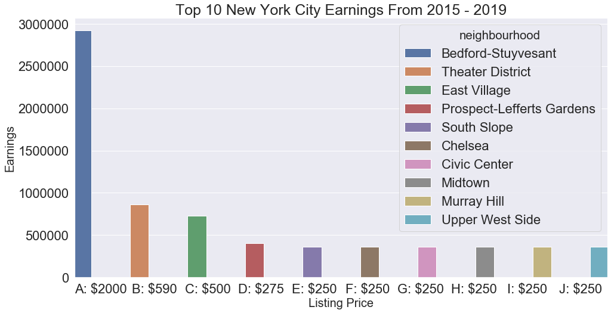

# Airbnb Data Analysis

 
## Overview
As we all strive for financial independence, one question that seems to linger in the minds of most individuals is: how can I earn passive income?

I welcome you all to join me as I explore data available from different industries to see which are viable for the everyday individual, lacking a trust-fund to back such investments.

First up on the list, consider investing in real estate. Yes! you read right, I said real estate but don’t get me wrong, I’m not referring to flipping of houses or investing in massive buildings, which are all great if you have the money for it whether personal or loans. Instead, I’m referring to an investment in the shared real estate economy….Airbnb! 

[Click here to read my medium post!](https://medium.com/@emi.nonye_33370/how-to-earn-passive-income-after-covid-19-8fc9883f3559)
